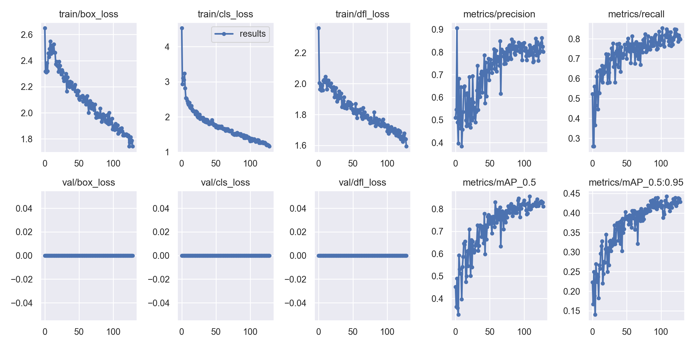

## コマンド

```bash
python train_dual.py --workers 8 --device 0 --batch 8 --data data/sugarcane.yaml --img 640 --cfg models/detect/yolov9-e.yaml --weights './weights/yolov9-e.pt' --name yolov9-e-sugarcane --hyp hyp.scratch-sugarcane.yaml --epochs 300 --close-mosaic 10 --patience 20
```

## 学習過程



## 結果


